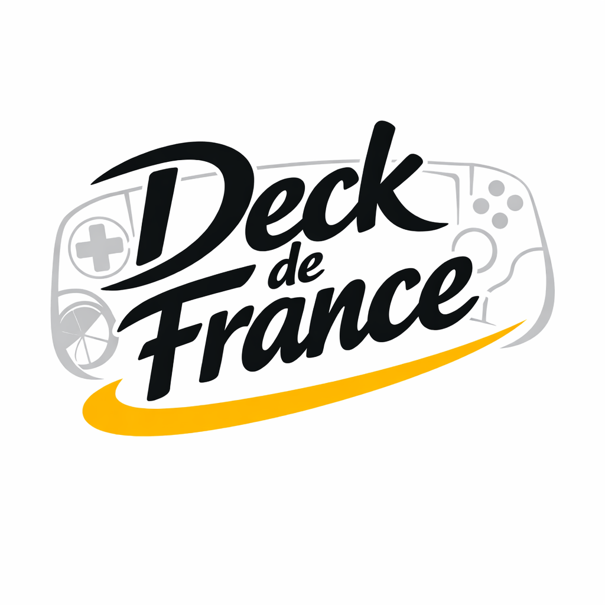

<p align="center">
  
</p>

# Installation Guide

A complete walkthrough for setting up deckdefrance on Steam Deck / SteamOS.

---

## Quick Start

```bash
cd ~/git/deckdefrance
./setup.sh
```

One command. Open a browser to `http://localhost:8000`. Done.

<details>
<summary><b>Advanced: run steps individually</b></summary>

```bash
./install-udev.sh   # permissions (one time)
./start.sh          # start the server
```

</details>

Follow the steps below for a full walkthrough.

---

## 1. Open a Terminal

On the Steam Deck:

1. Press the **Steam** button → **Power** → **Switch to Desktop**
2. Open the start menu (bottom-left) and search for **Konsole**
3. This is your terminal — you'll run commands here

---

## 2. Install Dependencies

In the terminal, run:

```bash
cd ~/git/deckdefrance
source .venv/bin/activate
pip install -r requirements.txt
```

This installs the Python packages deckdefrance needs. It's a one-time step.

**If you get an error about Python not found**, run this first:

```bash
python --version
```

You should see `Python 3.12.x`. If not, install Python from the Discover store.

---

## 3. Setup (One Command)

For most people, this one command does everything:

```bash
./setup.sh
```

It installs permissions, adds you to the right group, and starts the server. Type your password if prompted.

<details>
<summary><b>Want to run the steps separately?</b></summary>

### 3a. Set Up Permissions (One Time)

The app needs permission to create a virtual gamepad device:

```bash
./install-udev.sh
```

Type your password when prompted. Then log out and back in (or reboot) for the group changes to take effect.

### 3b. Start the Server

```bash
./start.sh
```

You'll see:

```
Stopping any running deckdefrance uvicorn sessions...
Starting deckdefrance in production mode...
```

The server is now running in the background. You can close the terminal.

</details>

---

## 5. Open the Dashboard

1. Open a web browser (Chrome or Firefox)
2. Go to: `http://localhost:8000`
3. You should see the deckdefrance dashboard with a yellow/black theme

**Can't connect?** Try `http://127.0.0.1:8000` instead.

---

## 6. Connect Your Trainer

### Step A — Find Your Trainer

1. In the dashboard, click the **Discover** tab
2. Click **Scan for Trainers**
3. Wait 5 seconds
4. Your trainer should appear in the list — click **Select**

The MAC address (a code like `F0:C5:70:96:A9:3B`) is now saved.

### Step B — Cache Bluetooth Services

When you click **Start Streaming**, the app will try to cache the trainer's Bluetooth services automatically. If it fails, do it manually:

1. **Wake the trainer** — pedal for a few seconds or unplug it and plug it back in
2. Open a terminal and run (replace MAC with your trainer's address):

```bash
timeout 30 bluetoothctl -- connect F0:C5:70:96:A9:3B
```

Wait up to 30 seconds. You might see `le-connection-abort-by-local` — that's normal. Just run the command again up to 3 times until it connects.

3. Once it connects, run:

```bash
bluetoothctl trust F0:C5:70:96:A9:3B
bluetoothctl disconnect F0:C5:70:96:A9:3B
```

4. Check that it worked:

```bash
bluetoothctl info F0:C5:70:96:A9:3B
```

You should see `UUID: Cycling Power (00001818-...)` in the output.

### Step C — Start Streaming

1. Go to the **Status** tab
2. Click **Start Streaming**
3. The status will show "Connecting..." for a few seconds, then "Connected"
4. Start pedaling — you'll see power (Watts) and cadence (RPM) on the chart

**It shows 0W?** Unplug the trainer for 10 seconds, plug it back in, wait 30 seconds, then try again.

---

## 7. Add a Bluetooth Controller (Optional)

### Pair It First

1. On the Steam Deck, go to **Settings → Bluetooth**
2. Put your controller in pairing mode
3. Select it in the list

### Merge It With the Trainer

1. Start **Tour de France** (or your game) on Steam
2. In the game's controller settings, select **Trainer Virtual Gamepad**
3. **Switch to the browser** (keep the game running)
4. Open the **Merge** tab in the dashboard
5. Click **Scan**
6. You'll see devices named "Microsoft X-Box 360 pad N"
   - **Skip index 0** — that's the Trainer Virtual Gamepad itself
   - Try index 1 — that's usually the Steam Deck's built-in controls
   - If you have a Bluetooth controller, it may be index 2 or higher
7. Click **Detect** on a device
   - Events appear immediately without touching anything → built-in Deck controls
   - Events appear when you press a button on your controller → that's your Bluetooth controller
8. Click **Start Merge** on the correct device
9. Go back to your game — both the trainer and your controller work together

---

## 8. Make It Auto-Start (Optional)

If you want deckdefrance to start automatically when you turn on your Steam Deck:

```bash
./install-service.sh
```

Now it will always be running in the background. The dashboard is always at `http://localhost:8000`.

To stop it:

```bash
systemctl --user stop deckdefrance
```

To check if it's running:

```bash
systemctl --user status deckdefrance
```

---

## Using FTP Presets

In the **Config** tab, you can pick a preset based on fitness level. These set the power thresholds automatically:

| Preset | Best for |
|--------|----------|
| **Beginner** | Casual riders, ~75W average power |
| **Average** | Regular cyclists, ~125W |
| **Competitive** | Club racers, ~200W |
| **Pro** | Elite athletes, ~300W |

Pick the one closest to your fitness. Click **Load Preset** then **Save**.

---

## Troubleshooting

### "Permission denied" errors
→ Run `./install-udev.sh` and log out/in

### "Device with address ... was not found"
→ The trainer Bluetooth services aren't cached. Run the `bluetoothctl -- connect` steps again (section 6B)

### Server won't start / "port already in use"
→ Run `pkill -f uvicorn`, wait 2 seconds, then `./start.sh` again

### Dashboard loads but chart is empty
→ Click **Start Streaming** in the Status tab. Make sure your trainer is powered on.

### Controller merge shows events but game doesn't respond
→ Make sure **Trainer Virtual Gamepad** is selected as the controller in the game's settings

### Page looks broken or missing styles
→ Hold **Ctrl** and click the **Reload** button (or press Ctrl+F5) to force-refresh the page

### Need help?
→ Open an issue at https://github.com/sukolupo/deckdefrance/issues
